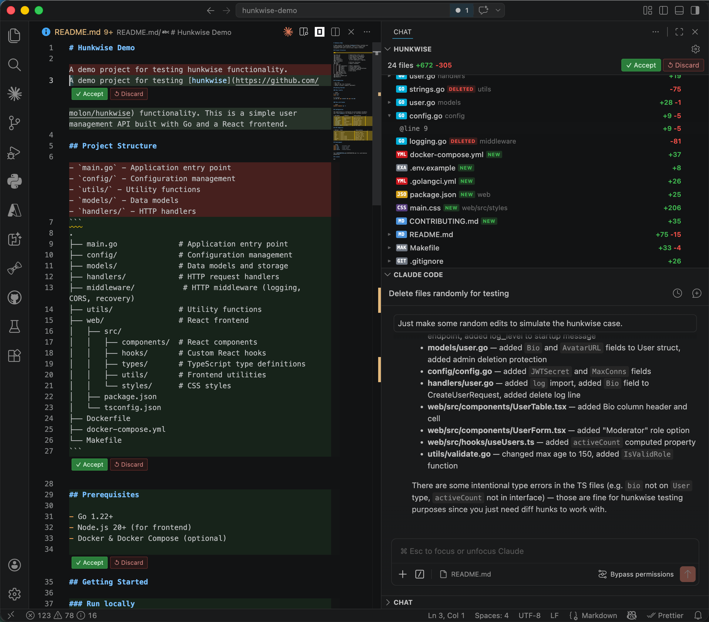

# hunkwise

Per-hunk Accept/Discard for any file change in VSCode.

AI coding tools like [Claude Code](https://docs.anthropic.com/en/docs/claude-code), [OpenCode](https://github.com/opencode-ai/opencode), and other CLI/plugin-based assistants lack a native IDE — unlike Cursor, Windsurf, or Copilot, they have no built-in way to review changes hunk by hunk. 

**hunkwise** fills that gap by bringing per-hunk review controls directly into VSCode for any external file change.



## Features

- Tracks file changes from any source (AI tools, scripts, manual edits)
- Per-hunk `✓ Accept | ↺ Discard` controls inline in the editor
- Added lines highlighted in green, removed lines highlighted in red
- Sidebar panel lists all pending files with hunk details and batch actions
- New files and deleted files are tracked and displayed
- State persisted across VSCode restarts via a lightweight internal git repo
- Respects `.gitignore` and custom ignore patterns

## Installation

hunkwise uses a [proposed VSCode API](https://code.visualstudio.com/api/advanced-topics/using-proposed-api) (`editorInsets`) and cannot be installed from the marketplace.

Install the `install-hunkwise` skill, which handles compiling, packaging, and configuring VSCode automatically:

```bash
npx skills add https://github.com/molon/hunkwise --skill install-hunkwise -g -y
```

Then invoke `/install-hunkwise` to install it.

## Usage

### Enable hunkwise

Click **Enable** in the hunkwise sidebar panel. hunkwise will snapshot all current workspace files as baselines.

### Automatic tracking

Once enabled, any external tool (AI assistant, script, etc.) that writes to a file will automatically trigger review mode for that file.

### Reviewing changes

- Click `✓` or `↺` above each hunk in the editor
- Use the **hunkwise** sidebar panel to:
  - See all files with pending changes
  - Accept or discard individual hunks
  - Accept or discard all changes in a file
  - Accept or discard all changes across all files
- Click a file name in the panel to open it
- Deleted files show a diff view with the original content

### Disable hunkwise

Click **Disable** in the panel. All tracked state is cleared.

## Commands

| Command | Description |
| ------- | ----------- |
| `hunkwise: Enable` | Enable hunkwise and snapshot the workspace |
| `hunkwise: Disable` | Disable hunkwise and clear all state |
| `hunkwise: Settings` | Open the settings panel |

## Settings

Settings are stored in `.vscode/hunkwise/settings.json` and can be changed via the settings panel:

| Setting | Default | Description |
| ------- | ------- | ----------- |
| `ignorePatterns` | `[".git"]` | Glob patterns to exclude from tracking |
| `respectGitignore` | `true` | Whether to honor `.gitignore` rules |
| `clearOnBranchSwitch` | `false` | Automatically clear all pending hunks when git branch changes |

## .gitignore

When enabled, hunkwise automatically adds `.vscode/hunkwise/` to your `.gitignore`.

## How it works

### Baseline tracking

When hunkwise is enabled, it snapshots all workspace files into a private git repository at `.vscode/hunkwise/git/`. This repo stores **baselines** — the content of each file at the moment hunkwise starts tracking. The repo always has exactly one commit (each mutation does `--amend`).

When an external tool modifies a file, hunkwise diffs the current content against the stored baseline to produce hunks. Accepting a hunk updates the baseline; discarding a hunk restores the baseline content.

### External vs manual change detection

hunkwise distinguishes between:

- **External changes** (AI tools, scripts): Detected when the file content on disk differs from the open editor buffer. These trigger review mode with inline hunks.
- **Manual edits** (user typing in VSCode): The editor buffer matches the disk content after save. These silently update the baseline — no hunks shown.

This means you can freely edit files while hunkwise is enabled, and only tool-generated changes will produce hunks.

### File rename and delete handling

- **Manual rename** (via VSCode explorer/API): hunkwise migrates the baseline to the new path. No spurious deletion hunk is shown.
- **Manual delete** (via VSCode explorer/API): hunkwise removes the baseline. No deletion hunk is shown.
- **External delete** (tool deletes a file): Shows a deletion hunk so you can review and restore if needed.

### Ignore rules

Files can be excluded from tracking via two mechanisms:

1. **ignorePatterns** in `.vscode/hunkwise/settings.json` — custom patterns (default: `[".git"]`, plus `".DS_Store"` on macOS)
2. **`.gitignore`** — when `respectGitignore` is true (default), workspace `.gitignore` rules are honored

When ignore rules change (`.gitignore` modified, or patterns updated via settings), hunkwise automatically:

- Removes baselines for files that are now ignored
- Adds baselines for files that are newly allowed

### State persistence

All baseline data is stored in the git repo and survives VSCode restarts. On reactivation, hunkwise reads baselines from `git ls-tree HEAD` + `git show :path` to restore in-memory state.

## Development

```bash
npm run compile          # compile TypeScript
npm run watch            # watch mode
npm test                 # run unit tests (node:test runner)
npm run test:integration # run VSCode integration tests
```

Unit tests cover `diffEngine`, `hunkwiseGit`, and `gitignoreManager`. They run with Node's built-in test runner and require no additional dependencies.

Integration tests run in a real VSCode extension host via `@vscode/test-cli` and cover rename/delete handling, .gitignore sync, file watching, and enable/disable lifecycle.
